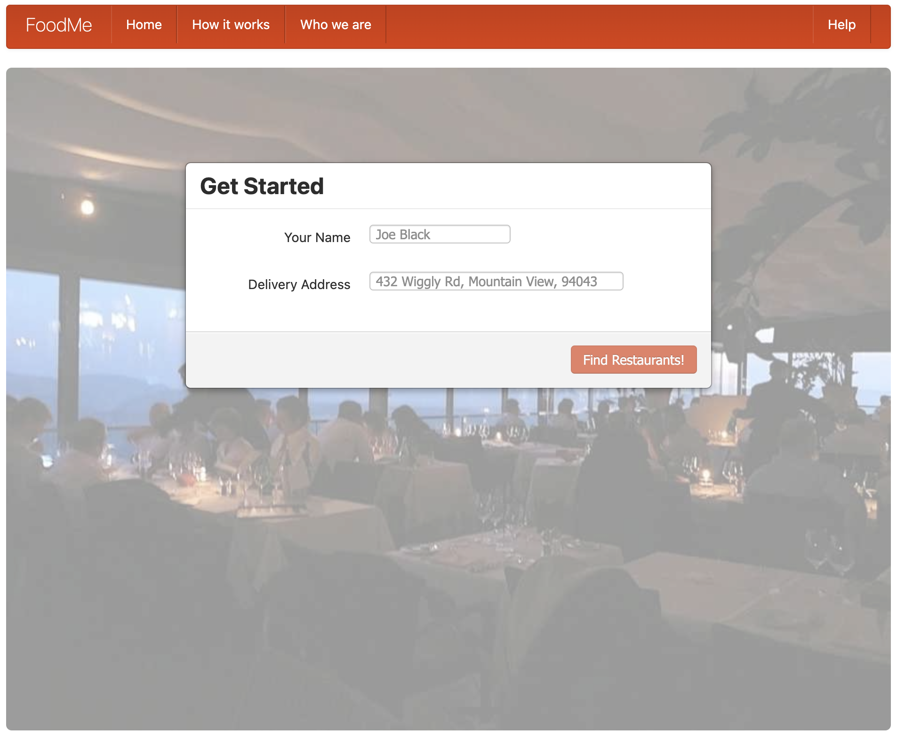
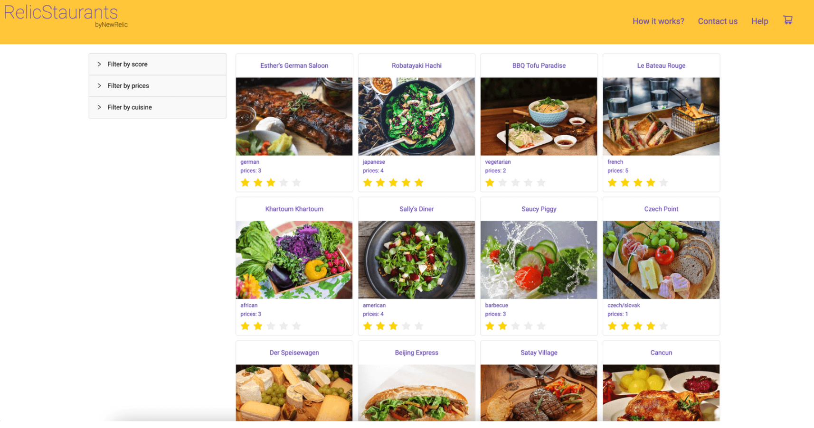

# New Relic demo apps for training labs

> **What is this space?** Are you interested in creating a hands-on lab to demonstrate a specific capability or tool? This repository is a collection of applications that have been designed to be quickly used in a lab scenario. Skip the step of finding/developing your own demo app and use one of these!

## App name: FoodMe

**Architecture:** FoodMe is a monolithic application. Built with angular on the frontend and Node on the backend.

**Description:** FoodMe is designed to provide a familiar online food ordering experience in the browser. As a monolith, it is very simple for the learner to spin up locally or in a browser-based IDE for free hosting.

| App version  | Description | Link(s) | 
| ----------- | ----------- | -------------| 
| FoodMe for APM | This version has APM instrumentation code found in several files and is documented in README.md | [GitHub Repo](https://github.com/Bijesse/nru-foodme-app), [Glitch environment](https://glitch.com/edit/#!/remix/foodme-fy23) |
| FoodMe for OTel | This version has OTel instrumentation code found in several files and is documented in README.md  | [GitHub Repo](https://github.com/Bijesse/foodme-otel), [Glitch environment](https://glitch.com/edit/#!/remix/foodme-otel)|

## App name: Relicstaurants

**Architecture:** This app is build with React. Some versions of the app are a monolith while others are built with microservice architecture 

**Description:** This app is similar to FoodMe in that is a food ordering service that lists the same restaurants. It differs in the way it is built so that different tools/features can be used.

| App version   | Description | Link(s) | 
| ------------- | ----------- | --------| 
| Monolith Relicaturants | A simple version of the applicaiton that includes instrumentation code | [Monolith Relicstaurants](https://github.com/newrelic-experimental/relicstaurants/tree/instrumented-version) |
| Mobile Relicaturants | Designed to be a React Native mobile application | [RelicsaurantReact](https://github.com/newrelic-experimental/relicstaurantReact) |
| Microservice Relicaturants | Includes 3 microservices and a frontend. Instructions for instrumenting and deploying in README.md | [Local deploy](https://github.com/newrelic-experimental/Relicstaurants-Platzi) |
| Microservice Relicaturants built for Docker | Includes 3 microservices and a frontend. Instructions for instrumenting and deploying with Docker in README.md | [Docker build](https://github.com/Bijesse/Relicstaurants-Docker) |

## App name: 

**Architecture:** This app is build with...

**Description:** A brief description of this app...

| App version   | Description | Link(s) | 
| ------------- | ----------- | --------| 
| App version 1 |  |  |
