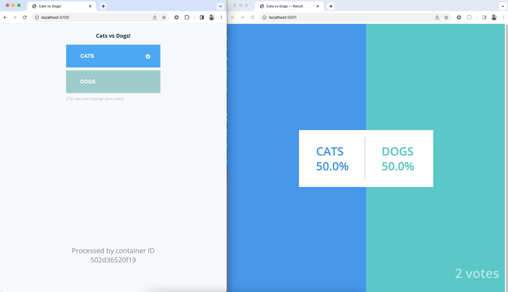

# New Relic demo apps for training labs

> **What is this space?** Are you interested in creating a hands-on lab to demonstrate a specific capability or tool? This repository is a collection of applications that have been designed to be quickly used in a lab scenario. Skip the step of finding/developing your own demo app and use one of these!

## App name: FoodMe

**Architecture:** FoodMe is a monolithic application. Built with angular on the frontend and Node on the backend.

**Description:** FoodMe is designed to provide a familiar online food ordering experience in the browser. As a monolith, it is very simple for the learner to spin up locally or in a browser-based IDE for free hosting.

| App version  | Description | Link(s) | 
| ----------- | ----------- | -------------| 
| FoodMe for APM | This version has APM instrumentation code found in several files and is documented in README.md | [GitHub Repo](https://github.com/Bijesse/nru-foodme-app), [Glitch environment](https://glitch.com/edit/#!/remix/foodme-fy23) |
| FoodMe for OTel | This version has OTel instrumentation code found in several files and is documented in README.md  | [GitHub Repo](https://github.com/Bijesse/foodme-otel), [Glitch environment](https://glitch.com/edit/#!/remix/foodme-otel)|

## App name: Voting app

**Architecture:** This microservice application includes 5 services across various languages and databases. More info can be found on the README file of each repo linked below.

**Description:** This app has been adapted from its original form in the [Docker Samples Repository](https://github.com/dockersamples/example-voting-app). It provides a simple UI to have users select one of two options and have their responses viewed on a secondary page. 

| App version   | Description | Link(s) | 
| ------------- | ----------- | --------| 
| Voting App unistrumented | A version of the application that does not include New Relic instrumentation code. Instructions for a local deploy, APM, and Infrastructure instrumentation can be found in the README file | [Voting App unistrumented](https://github.com/mchavez-newrelic/example-voting-app) |
| Voting App instrumented| A version of the application that includes New Relic APM instrumentation code scross 3 services. Instructions for a local deploy, or Codespaces deploy can be found in the README file  | [Local deploy](https://github.com/Bijesse/example-voting-app-fully-instrumented), [Codespaces deploy](https://github.com/Bijesse/example-voting-app-fully-instrumented/tree/codespace-instructions) |

## App name: Online Boutique (formely Hipster Shop)

**Architecture:** This microservice application includes 11 services across various languages and databases. More info can be found on the README file of each repo linked below.

**Description:** This app has been adapted from its original form created by the GCP team [Repository](https://github.com/GoogleCloudPlatform/microservices-demo). It is an exmaple online retailer. 

| App version   | Description | Link(s) | 
| ------------- | ----------- | --------| 
| Online Boutique OpenTelemetry instrumented | A version of the application that has been instrumented with OpenTelemtry across 10 of the services and APM for one service| [OpenTelemetry instrumented](https://github.com/newrelic-experimental/otel-workshop) |

## App name: 

**Architecture:** This app is build with...

**Description:** A brief description of this app...

| App version   | Description | Link(s) | 
| ------------- | ----------- | --------| 
| App version 1 |  |  |
